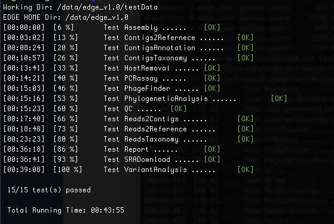

.. warning:: This is for development version of EDGE.  Stable version (v2.3) is `here. <https://edge.readthedocs.io/en/v2.3/installation.html>`_

Installation
############

.. note:: These instructions assumes Ubuntu 18 and CentOS 7

EDGE Installation
=================

.. note:: A base install is ~12GB for the code base and ~500GB for the databases.

1. Please ensure that your system has the :doc:`essential software building packages <system_requirement>`. installed properly before proceeding following installation.

2. Download the codebase, databases and third party tools.::

	## Codebase is ~207Mb and contains all the scripts and HTML needed to make EDGE run
	wget -c https://ref-db.edgebioinformatics.org/EDGE/2.x/edge_2.4_main.tgz

	## Third party tools is ~2.8Gb and contains the underlying programs needed to do the analysis
	wget -c https://ref-db.edgebioinformatics.org/EDGE/2.x/edge_2.4_thirdParty_softwares.tgz

	## Pipeline database is ~17Gb and contains the other databases needed for EDGE
	wget -c https://ref-db.edgebioinformatics.org/EDGE/dev/edge_dev_pipeline_databases.tgz
	
	## BWA index is ~41Gb and contains the databases for bwa taxonomic identification pipeline
	wget -c https://ref-db.edgebioinformatics.org/EDGE/dev/edge_dev_bwa_index.tgz
	
	## HOST genomes BWA index is ~41Gb for Host removal, including human, bacteria, phiX, viruses, invertebrate vectors of human pathogens
	wget -c https://ref-db.edgebioinformatics.org/EDGE/dev/edge_dev_HostIndex.tgz
	
	## NCBI Genomes is ~21Gb and contain the full genomes for prokaryotes and some viruses
	wget -c https://ref-db.edgebioinformatics.org/EDGE/dev/edge_dev_NCBI_genomes.tgz
	
	## GOTTCHA database is ~16Gb and contains the custom databases for the GOTTCHA taxonomic identification pipeline
	wget -c https://ref-db.edgebioinformatics.org/EDGE/dev/edge_dev_GOTTCHA_db.tgz
		
	## Amplicon database is ~78Mb and contains the databases for Qiime 16s and 18s ITS pipeline
	wget -c https://ref-db.edgebioinformatics.org/EDGE/dev/edge_dev_amplicons_db.tgz
	
	## NT database is ~25Gb and contains the NCBI nt database for contig identification
	wget -c https://ref-db.edgebioinformatics.org/EDGE/dev/edge_dev_nt_20160426.tgz
	
	## ShortBRED database is ~27Mb and contains the databases used by ShortBRED for virulence factors and read based antibiotic resistance analysis
	wget -c https://ref-db.edgebioinformatics.org/EDGE/dev/edge_dev_ShortBRED_Database.tgz
	
	## Diamond database is ~16Gb and contains the databases from RefSeq for protein based taxonomic identification
	wget -c https://ref-db.edgebioinformatics.org/EDGE/dev/edge_dev_diamond_db.tgz

        ## MetaPhlAn2 database is 1.1Gb file contains the databases used for the MetaPhlAn2 taxonomic identification pipeline
        wget -c https://ref-db.edgebioinformatics.org/EDGE/dev/edge_dev_metaphlan2DB.tgz

	## GOTTCHA2 databases is 38Gb file and contains the custom databases for the GOTTCHA2 taxonomic identification pipeline 
	wget -c https://ref-db.edgebioinformatics.org/EDGE/dev/edge_GOTTCHA2_db_20190729.tgz

        ## Kraken2 database is 26Gb file contains the databases used for the Kraken2 taxonomic identification pipeline
        wget -c https://ref-db.edgebioinformatics.org/EDGE/dev/edge_Kraken2_db_20190104.tgz
	
        ## Centrifuge database is 20G file contains the databases used for the Centrifuge taxonomic identification pipeline
        wget -c https://ref-db.edgebioinformatics.org/EDGE/dev/edge_Centrifuge_db_20200329.tgz

        ## PanGIA database is 15G file for PanGIA taxonomic identification pipeline
        wget -c https://ref-db.edgebioinformatics.org/EDGE/dev/edge_dev_PanGIA_db.tgz

        ## MICCR database is 48GB contains the databases used for the contig taxonomic identification pipeline
        wget -c https://ref-db.edgebioinformatics.org/EDGE/dev/edge_ContigTax_db_20190114.tgz

        ## CheckM database is 275MB contains the databases used for the Metagenome Binned contig quality assessment.
        wget -c https://ref-db.edgebioinformatics.org/EDGE/dev/edge_checkM_db_20190213.tgz

        ## Qiime2 database is 1.1GB contians 16s,18s and ITS db.
        wget -c  https://ref-db.edgebioinformatics.org/EDGE/dev/edge_qiime2_db_20191218.tgz

	(Optional)
	## Other Host bwa index ~18Gb for host removal, including pig, sheep, cow, monkey, hamster. and goat.
	wget -c https://ref-db.edgebioinformatics.org/EDGE/dev/edge_dev_otherHostIndex.tgz
	
	## For machine with < 32Gb memory, we suggest to use the smaller BWA index (~14Gb) and contains the databases for bwa taxonomic identification pipeline 
	wget -c https://ref-db.edgebioinformatics.org/EDGE/dev/edge_dev_bwa_mini_index.tgz
        
.. warning:: Be patient; the database files are huge.

3. Unpack main archive::

	tar -xvzf edge_2.4_main.tgz

.. note:: The main directory, edge_dev, will be created.

	Create a link from edge to that directory::

		ln -sf edge_dev edge

4. Unpack the third party software into main directory (edge)::

	tar -xvzf edge_2.4_thirdParty_softwares.tgz -C edge/
	
.. note:: You should see a thirdParty directory inside the edge directory.

.. note:: 
        If you are updating from old version, you should still expand the new thirdParty tgz file into the existing thirdParty directory.

5 Unpack the databases::
	
	# unpack databases
	tar -xvzf edge_dev_pipeline_databases.tgz
	tar -xvzf edge_dev_GOTTCHA_db.tgz
	tar -xzvf edge_dev_bwa_index.tgz
	tar -xvzf edge_dev_NCBI_genomes.tar.gz
	tar -xzvf edge_dev_amplicons_db.tgz
	tar -xzvf edge_dev_nt_20160426.tgz
	tar -xvzf edge_dev_ShortBRED_Database.tgz
        tar -xvzf edge_dev_HostIndex.tgz
        tar -xvzf edge_dev_diamond_db.tgz
        tar -xvzf edge_dev_metaphlan2DB.tgz
        tar -xvzf edge_GOTTCHA2_db_20181115.tgz
        tar -xvzf edge_Kraken2_db_20190104.tgz
        tar -xvzf edge_ContigTax_db_20190114.tgz
        tar -xvzf edge_checkM_db_20190213.tgz
        tar -xvzf edge_qiime2_db_20190227.tgz

.. note:: At this point, you should see a database directory and the edge directory.

6. Create the symlink from edge to the database directory::

	ln -s `pwd`/database edge/database

.. note:: This will keep the database directory outside of the edge install location.  Should you need to reinstall the code base you will not need to redownload/install the databases.

7. Installing pipeline::

	cd edge
	./INSTALL.sh

.. note:: When installing JBrowse, it may require internet connection.

.. note:: If the machine is shared and used with others, the system installed tools version may not be compatible with EDGE. In this case, we would suggest to use force option :code:`./INSTALL.sh force` to install all list tools locally.

It will install the following depended :doc:`tools <third_party>`.

  * Assembly

	* idba
	* spades
	* megahit
	* long_read_assembly
        * racon
        * unicycler

  * Annotation

	* prokka
	* RATT
	* tRNAscan
	* barrnap
	* BLAST+
	* blastall
	* phageFinder
	* glimmer
	* aragorn
	* prodigal
	* tbl2asn
	* ShortBRED
        * antismash

  * Alignment

	* hmmer
	* infernal
	* bowtie2
	* bwa
	* mummer
	* RAPSearch2
	* diamond
	* minimap2

  * Taxonomy

	* kraken2
	* metaphlan2
	* kronatools
	* gottcha
	* gottcha2
        * centrifuge
        * miccr
        * pangia

  * Phylogeny

	* FastTree
	* RAxML

  * Metagenome

        * MaxBin    
        * checkM

  * Utility

	* FaQCs
	* bedtools
	* R
	* GNU_parallel
	* tabix
	* JBrowse
	* bokeh
	* primer3
	* samtools
	* bcftools
	* sratoolkit
	* ea-utils
	* omics-pathway-viewer
	* NanoPlot
	* Porechop
        * seqtk
	* Rpackages
        * Chromium

  * Perl_Modules

	* perl_parallel_forkmanager
	* perl_excel_writer
	* perl_archive_zip
	* perl_string_approx
	* perl_pdf_api2
	* perl_html_template
	* perl_html_parser
	* perl_JSON
	* perl_bio_phylo
	* perl_xml_twig
	* perl_cgi_session
	* perl_email_valid
	* perl_mailtools

  * Python_Packages
  
	* Anaconda2
	* Anaconda3

  * Pipeline_Tools
  
	* DETEQT
	* reference-based_assembly
	* PyPiReT
        * qiime2
	
8. Restart the Terminal Session to allow $EDGE_HOME to be exported.

.. note:: After running INSTALL.sh successfully, the binaries and related scripts will be stored in the ./bin and ./scripts directory. It also writes EDGE_HOME environment variable into .bashrc or .bash_profile.

.. _apache_configuration:

Testing the EDGE Installation
-----------------------------

After installing the packages above, it is highly recommended to test the installation::

	> cd $EDGE_HOME/testData
	> ./runAllTest.sh

There are 20 module/unit tests which took around 2 hours07 mins in our testing environments. (64 cores 2.30GHz, 512GB ram with CentOS-7.1.1503 ). 
You will see test output on the terminal indicating test successes and failures. The **Specialty Genes Profiling test** will fail in this stage since it requires `virulence database imported <installation.html#mysql-databases-creation>`_ and `configured <installation.html#edge-configuration>`_. 
You can test it again after database created and configured. Some tests may fail due to missing external applications/modules/packages or failed installation.
These will be noted separately in the $EDGE_HOME/testData/runXXXXTest/TestOutput/error.log or log files in each modules. If these are related to features of EDGE that you are not using, this is acceptable. 
Otherwise, you’ll want to ensure that you have the EDGE installed correctly. If the output doesn't indicate any failures, you are now ready to use EDGE through command line. 
To take advantage of the user friendly GUI, please follow the section below to configure the EDGE Web server. 

Apache Web Server Configuration
-------------------------------

1. Modify/Check sample apache configuration file::

	For Ubuntu

	Double check $EDGE_HOME/edge_ui/apache_conf/edge_apache.conf alias directories the match EDGE
	installation path at line 2,5,6,16,17,29,38,69.

	The default is configured as http://localhost/edge_ui/ or http://www.yourdomain.com/edge_ui/

	For CentOS

	Double check $EDGE_HOME/edge_ui/apache_conf/edge_httpd.conf alias directories the match EDGE
	installation path at line 2,5,6,16,17,29,38,70.

	The default is configured as http://localhost/edge_ui/ or http://www.yourdomain.com/edge_ui/

2. Confirm apache/httpd user and groups are edge::

	For Ubuntu

	The user and group can be edited at /etc/apache2/envvars and the variables are APACHE_RUN_USER and APACHE_RUN_GROUP.

	For CentOS

	The User and Group on lines 66 and 67 in $EDGE_HOME/edge_ui/apache_conf/centos_httpd.conf should be edge
	
	## Make APACHE_RUN_USER have Permission to write
	> sudo chown -R xxxxx $EDGE_HOME/edge_ui  $EDGE_HOME/edge_ui/JBrowse/data  #(xxxxx is the APACHE_RUN_USER value)

	> sudo chgrp -R xxxxx $EDGE_HOME/edge_ui  $EDGE_HOME/edge_ui/JBrowse/data  #(xxxxx is the APACHE_RUN_GROUP value)

3. (Optional) If users are behind a corporate proxy for internet:: 

	Please add proxy info into $EDGE_HOME/edge_ui/apache_conf/edge_apache.conf or $EDGE_HOME/edge_ui/apache_conf/edge_httpd.conf

	# Add following proxy env
	SetEnv http_proxy http://yourproxy:port
	SetEnv https_proxy http://yourproxy:port
	SetEnv ftp_proxy http://yourproxy:port
 
4. Copy configuration files to the appropriate directories::

	For Ubuntu

	> sudo cp $EDGE_HOME/edge_ui/apache_conf/edge_apache.conf /etc/apache2/conf-available/
	> sudo ln -s /etc/apache2/conf-available/edge_apache.conf /etc/apache2/conf-enabled/
	> sudo cp $EDGE_HOME/edge_ui/apache_conf/pangia-vis.conf /etc/apache2/conf-available/
	> sudo ln -s /etc/apache2/conf-available/pangia-vis.conf /etc/apache2/conf-enabled/

	For CentOS

	> sudo cp $EDGE_HOME/edge_ui/apache_conf/edge_httpd.conf /etc/httpd/conf.d/
	> sudo cp -f $EDGE_HOME/edge_ui/apache_conf/centos_httpd.conf /etc/httpd/conf/httpd.conf
	> sudo cp $EDGE_HOME/edge_ui/apache_conf/pangia-vis.conf /etc/httpd/conf.d/

5. (Optional) HTTPS / SSL configuration::

	i. Please add redirect conditions into $EDGE_HOME/edge_ui/apache_conf/edge_apache.conf or $EDGE_HOME/edge_ui/apache_conf/edge_httpd.conf
	
	# Add redirect to https
	RewriteEngine on
	RewriteCond %{HTTPS} !=on
	RewriteRule ^(.*) https://%{SERVER_NAME}$1 [R,L]

	ii. Use pangia-vis-https.conf instead of pangia-vis.conf
	
	For Ubuntu
	> sudo cp $EDGE_HOME/edge_ui/apache_conf/pangia-vis-https.conf /etc/apache2/conf-available/pangia-vis.conf
	
	For CentOS
	> sudo cp $EDGE_HOME/edge_ui/apache_conf/pangia-vis-https.conf /etc/httpd/conf.d/
	
	iii. Add SSL configuration:: 
	
	see edge_ssl.conf using letsencrypt (https://letsencrypt.org/) as an example.  Please modify it as your environments and
	
	copy modified $EDGE_HOME/edge_ui/apache_conf/edge_ssl.conf to /etc/httpd/conf.d/ for CentOS or /etc/apache2/conf-enabled/ for Ubuntu.
	
6. Restart the apache2/httpd to activate the new configuration::

	For Ubuntu

	> sudo service apache2 restart

	For CentOS

	> sudo systemctl restart httpd

User Management System Installation: MySQL
------------------------------------------
.. note:: 
	Setup two temporary environmental variables::

		UN=username
		PW=password

	These will be used when setting up the user management system

.. note:: 
        If you were using the user management system and are updating from old EDGE version to this version. You only need to run the commands below and continue to install tomcat.::
 
                cd $EDGE_HOME/userManagement
                mysql -u $UN -p userManagement
                mysql> source update_userManagement_db.sql

.. note::
       For MySQL 5.7 (Ubuntu 18.04), please append following content to /etc/mysql/my.cnf ::
       
           [mysqld]
           show_compatibility_56 = on
           sql-mode=""

1. Start mysql (if it is not already running)::

	For Ubuntu

	> sudo service mysql start

	For CentOS

	> sudo systemctl start mariadb.service && sudo systemctl enable mariadb.service

2. Secure mysql:

	.. note:: The root password here is for the mysql root and not the system root.

	::

	> sudo mysql_secure_installation

	1. Enter root password (likely none)
	2. Set root password?  Yes
	3. Enter new root password.
	4. Re-enter new root password.
	5. Remove anonymous users? Yes
	6. Disallow root login remotely? Yes
	7. Remove test database and access to it? Yes
	8. Reload privilege table now? Yes

3. Create database: userManagement::

	 > cd $EDGE_HOME/userManagement
	 > mysql -p -u root

	 mysql> create database userManagement;
	 mysql> use userManagement;

4. Load userManagement_schema.sql::

	mysql> source userManagement_schema.sql;

5. Load userManagement_constrains.sql::

	mysql> source userManagement_constrains.sql;

6. Create an user account and grant all privileges to user:

	.. note::

		This is the database user (not an individual EDGE user account). 
		
		Replace with the appropriate values::

			username: yourDBUsername
			password: yourDBPassword

	::

		mysql> CREATE USER 'yourDBUsername'@'localhost' IDENTIFIED BY 'yourDBPassword';
		mysql> GRANT ALL PRIVILEGES ON userManagement.* to 'yourDBUsername'@'localhost';
		mysql> exit;
        
        If you need to allow remote access mysql, you will need to change localhost to % and comment out
        bind_address=127.0.0.1 at /etc/mysql/mysql.conf.d/mysqld.cnf

                
		mysql> CREATE USER 'yourDBUsername'@'%' IDENTIFIED BY 'yourDBPassword';
		mysql> GRANT ALL PRIVILEGES ON userManagement.* to 'yourDBUsername'@'%';
		mysql> exit;

User Management System Installation: Tomcat
-------------------------------------------

.. note:: 
        If you were using the user management system and are updating from old EDGE version to this version. You only need continue from step 6.
 

1. Configure tomcat basic auth to secure /user/admin/register web service:

	.. warning:: Run this code only once!

	.. note::

		The username and password here should be the same as the database user.

		Update the values for the username and password accordingly before running the code.

		This adds the following to /usr/share/tomcat/conf/tomcat-users.xml or /usr/share/tomcat7/conf/tomcat-users.xml::

			<role rolename="admin"/>
			<user username="yourAdminName" password="yourAdminPassword" roles="admin"/>

	::

		For Ubuntu

		sudo sed -i 's@</tomcat-users>@<role rolename="admin"/>\n<user username="'"${UN}"'" password="'"${PW}"'" roles="admin"/>\n</tomcat-users>@g' /usr/share/tomcat7/conf/tomcat-users.xml

		For CentOS

		sudo sed -i 's@<!-- <role rolename="admin"/> -->@<!-- <role rolename="admin"/> -->\n<role rolename="admin"/>\n<user username="'"${UN}"'" password="'"${PW}"'" roles="admin"/>@g' /usr/share/tomcat/conf/tomcat-users.xml

2. Update inactive timeout to a more reasonable number 4320 min (3 days) from default (30mins) in /usr/share/tomcat7/conf/web.xml or /etc/tomcat/web.xml

	.. note::

		This is modifying the following code::

			<!--  <session-config>
				<session-timeout>30</session-timeout>
			</session-config> -->

	::

		For Ubuntu

		sudo sed -i 's@<session-timeout>.*</session-timeout>@<session-timeout>4320</session-timeout>@g' /usr/share/tomcat7/conf/web.xml

		For CentOS

		sudo sed -i 's@<session-timeout>.*</session-timeout>@<session-timeout>4320</session-timeout>@g' /usr/share/tomcat/conf/web.xml

3. Add memory constrains to Java:

	.. warning:: Run this code only once!

	.. note::

		This will add the following line to the appropriate file::

			JAVA_OPTS=" -Xms256M -Xmx1024M -XX:PermSize=256m -XX:MaxPermSize=512m"

	::

		For Ubuntu

		sudo sed -i 's@#JAVA_OPTS@JAVA_OPTS="-Xms256m -Xmx1024m -XX:PermSize=256m -XX:MaxPermSize=512m"\n#JAVA_OPTS@g' /usr/share/tomcat7/bin/catalina.sh

		For CentOS

		sudo sed -i 's@#JAVA_OPTS@JAVA_OPTS="-Xms256m -Xmx1024m -XX:PermSize=256m -XX:MaxPermSize=512m"\n#JAVA_OPTS@g' /usr/share/tomcat/conf/tomcat.conf

4. Restart tomcat server::

	For Ubuntu
	sudo /usr/share/tomcat7/bin/startup.sh

	For CentOS7
	sudo systemctl restart tomcat

5. Copy database connector clients to appropriate lib directory::

	For Ubuntu

	sudo cp mysql-connector-java-5.1.34-bin.jar /usr/share/tomcat7/lib/
	sudo chmod 744 /usr/share/tomcat7/lib/mysql-connector-java-5.1.34-bin.jar 

	For CentOS

	sudo cp mariadb-java-client-1.2.0.jar /usr/share/tomcat/lib/
	sudo chmod 744 /usr/share/tomcat/lib/mariadb-java-client-1.2.0.jar

6. Centos Only: Update the MySQL database driver to be used::

	sed -i 's@driverClassName=.*$@driverClassName="org.mariadb.jdbc.Driver"@' $EDGE_HOME/userManagement/userManagementWS.xml

7. Deploy userManagement to tomcat server:

	.. note::

		For CentOS the userManagementWS.xml should have:: 

			driverClassName="org.mariadb.jdbc.Driver"

		Please check and confirm this before deploying userManagement.

	::

		For Ubuntu

		sudo rm -rf /usr/share/tomcat7/webapps/userManagementWS
		sudo cp userManagementWS.war /usr/share/tomcat7/webapps/
		sudo rm -rf /usr/share/tomcat7/webapps/userManagement
		sudo cp userManagement.war /usr/share/tomcat7/webapps/
		sudo chmod 755 /usr/share/tomcat7/webapps/*war
		sudo cp userManagementWS.xml /usr/share/tomcat7/conf/Catalina/localhost/
		sudo chmod 744 /usr/share/tomcat7/conf/Catalina/localhost/userManagementWS.xml

		For CentOS

		sudo rm -rf /var/lib/tomcat/webapps/userManagementWS
		sudo cp userManagementWS.war /var/lib/tomcat/webapps/
		sudo rm -rf /var/lib/tomcat/webapps/userManagement
		sudo cp userManagement.war /var/lib/tomcat/webapps/
		sudo chmod 755 /var/lib/tomcat/webapps/*war
		sudo cp userManagementWS.xml /etc/tomcat/Catalina/localhost/
		sudo chmod 744 /etc/tomcat/Catalina/localhost/userManagementWS.xml

8. Modify the username/password in userManagementWS.xml::

	For Ubuntu
	
	sudo sed -i 's@username=.*$@username="'"${UN}"'"@' /usr/share/tomcat7/conf/Catalina/localhost/userManagementWS.xml
	sudo sed -i 's@password=.*$@password="'"${PW}"'"@' /usr/share/tomcat7/conf/Catalina/localhost/userManagementWS.xml

	For CentOS
	
	sudo sed -i 's@username=.*$@username="'"${UN}"'"@' /etc/tomcat/Catalina/localhost/userManagementWS.xml
	sudo sed -i 's@password=.*$@password="'"${PW}"'"@' /etc/tomcat/Catalina/localhost/userManagementWS.xml

9. Update sys.properties in the userManagement deployment:

	.. note::

		Tomcat should automatically unarchive the .war files. 

		The default configuration is to have the user management system on localhost with email notifications turned off.

                For "Forgot your password" reset function, the 'email_notification' should be on and a valid email address for 'email_sender'

		Modify the user management sys.properties if you want to change the default behavior. (make sure port match with tomcat server)

		You will need to copy the sys.properties files to the directory of the userManagement deployment.

	::

		For Ubuntu

		sudo cp $EDGE_HOME/userManagement/sys.properties /usr/share/tomcat7/webapps/userManagement/WEB-INF/classes/sys.properties
		sudo chmod 744 /usr/share/tomcat7/webapps/userManagement/WEB-INF/classes/sys.properties

		For CentOS

		sudo cp $EDGE_HOME/userManagement/sys.properties /usr/share/tomcat/webapps/userManagement/WEB-INF/classes/sys.properties
		sudo chmod 744 /usr/share/tomcat/webapps/userManagement/WEB-INF/classes/sys.properties

10. Restart tomcat server::

	For Ubuntu
	sudo /usr/share/tomcat7/bin/shutdonw.sh
	sudo /usr/share/tomcat7/bin/startup.sh

	For CentOS7
	sudo systemctl restart tomcat

11. Setup admin user:

	.. note::

		The script createAdminAccount.pl creates an admin user account for EDGE userManagement.

			Update email (-e), First Name (-fn), and Last Name (-ln) appropriately.
		
		It will ask `tomcat service username and password <installation.html#user-management-system-installation-tomcat>`_ (tomcat-users.xml:) before creating EDGE user account (email).
		
		If "HTTP Status 401" error shows, please make sure the tomcat username and password in the `first step <installation.html#user-management-system-installation-tomcat>`_ match with what entered here.

                If "HTTP Status 403" error shows, please make sure the tomcat rolename in the `first step <installation.html#user-management-system-installation-tomcat>`_ match with /var/lib/tomcat/webapps/userManagementWS/WEB-INF/web.xml and where the web.xml file existed or not. 

                If "HTTP Status 500" error shows, please make sure the port (default: 8080) for tomcat service are matched in tomcat server.xml, $EDGE_HOME/edge_ui/sys.properties and $EDGE_HOME/userManagement/sys.properties (need to redo step 9).

                If "Fatal Exception: Could not create resource factory instance during transaction connect" error shows, please make suer the tomcat userManagementWS.xml is in /etc/tomcat/Catalina/localhost/ or /usr/share/tomcat7/conf/Catalina/localhost/ and corret.
		 
                If you want to use userManagment as a remote service instead of localhost, please modify the userManagementWS.xml file to allow access from remote ip address, and corresponding mysql address.

		Should this script fail, the userManagement is not set up correctly.

	::

		perl createAdminAccount.pl -e <email> -fn <first name> -ln <last name>

12. Enable userManagement in EDGE sys.properties:

	.. note:: See :ref:`EDGE Configuration<edge_configuration>` below

	::

	> sed -i 's@user_management=.*$@user_management=1@g' $EDGE_HOME/edge_ui/sys.properties
	> sed -i 's@edge_user_management_url=.*$@edge_user_management_url=http://localhost/userManagement@g' $EDGE_HOME/edge_ui/sys.properties 

13. Optional: configure social (facebook,google,windows live, Linkedin) login function:

	* modify $EDGE_HOME/edge_ui/javascript/social.js, change apps id you created on each social media.

	.. note :: This allow users to use their social media account to login EDGE. You need to register your EDGE's domain on each social media to get apps id. e.g.: A FACEBOOK app needs to be created and configured for the domain and website set up by EDGE.
		   see `https://developers.facebook.com/ <https://developers.facebook.com/.>`_	and
		   `StackOverflow Q&A <http://stackoverflow.com/questions/16345777/given-url-is-not-allowed-by-the-application-configuration>`_

		   `Google+ <https://console.developers.google.com/>`_

		   `Windows <https://account.live.com/developers/applications/index>`_

		   `LinkedIn <https://www.linkedin.com/secure/developer>`_

14. Optional: configure sendmail to use SMTP to email out of local domain:

                * edit /usr/share/tomcat7/conf/Catalina/localhost/userManagementWS.xml (Ubuntu) or /etc/tomcat/Catalina/localhost/userManagementWS.xml (CentOS)

                        email_host=<ip or host name>

		* edit /etc/mail/sendmail.cf and edit this line:

			# "Smart" relay host (may be null)
			DS

		* and append the correct server right next to DS (no spaces);

			# "Smart" relay host (may be null)
			DSmail.yourdomain.com

		* Then, restart the sendmail service

			> sudo service sendmail restart

MYSQL Databases CREATION
------------------------

.. note:: This requires that MySQL is installed and running. 

.. note:: EDGE provides Virulence Factors, Metadata, and Pathogen sql dump files which will be used for Speciality Gene Profling module, Sample MetaData module and Pathogen Detection module, respectively. You will need configure the database info in the $EDGE_HOME/edge_ui/sys.properties. See :ref:`EDGE Configuration<edge_configuration>` below

1. Change directory into database::

	cd $EDGE_HOME/SQLdbfile

2. Run install script for databases and Grant privilege database user to have access to the databases::

	mysql -u root -p  

	mysql> source virulence_db.sql ;
	mysql> GRANT ALL PRIVILEGES ON virulenceFactors.* to 'yourDBUsername'@'localhost';
	
	mysql> create database edgeDB;
	mysql> use edgeDB;
	mysql> source edge_db.sql ;
	mysql> GRANT ALL PRIVILEGES ON edgeDB.* to 'yourDBUsername'@'localhost';
	
	mysql> create database pathogens ;
	mysql> use pathogens;
	mysql> source pathogen_db.sql ;
	mysql> GRANT ALL PRIVILEGES ON pathogens.* to 'yourDBUsername'@'localhost';
	mysql> exit;

3. Configure Virulence, Metadata and Pathogen Database information::

	Edit $EDGE_HOME/edge_ui/sys.properties with the appropriate database username and password.

	# Virluence Factors database
	VFDB_dbhost = localhost
	VFDB_dbport = 3306
	VFDB_dbname = virulenceFactors
	VFDB_dbuser = edge_user
	VFDB_dbpasswd = edge_user_password
	
	##configure edge pathogen detection 1: with 0: without
	edge_pathogen_detection=0
	pathogen_dbhost=localhost
	pathogen_dbname=pathogens
	pathogen_dbuser=edge_user
	pathogen_dbpasswd=edge_user_password
	
	##configure edge sample metadata option 1: with 0: without
	edge_sample_metadata=0
	edge_dbhost=localhost
	edge_dbname=edgeDB
	edge_dbuser=edge_user
	edge_dbpasswd=edge_user_password
	
.. _edge_configuration:

EDGE configuration
------------------

.. note:: EDGE system configuration file is $EDGE_HOME/edge_ui/sys.proprties. You can edit this file to turn on/off EDGE functions/modules here. (on=1, off=0); 

1. Add EDGE GUI admin info:

#According to `User Management system installation <installation.html#user-management-system-installation-tomcat>`_ step 11::
	
	edgeui_admin=admin@my.com
	edgeui_admin_password=admin
	
2. Turn on user management system:

	.. note::

		This assumes localhost is the domain. Update the domain as necessary.
		If user management system is not in the same domain with EDGE.::
		   
			edge_user_management_url=http://www.someother.com/userManagement

	::

		# If you have User Management system enabled.
		user_management=1
		edge_user_management_url=http://localhost/userManagement

3. Turn on upload function::

	user_upload=1
	user_upload_maxFileSize='5gb'
	
4. Turn on project intermediate files clean up::

	#Clean up old bam/sam/fastq/gz files (based on file age) in project directories
	edgeui_proj_store_days=10

5. Set up the archive directory::

	#The archive space is for offload the main computational disk space
	edgeui_archive=/path/to/archive_SPACE

7. Adjust number of CPUs assigned to EDGE and number of job able to run simultaneously::

        edgeui_tol_cpu=4
        max_num_jobs=2
	
8. Turn on/off Social Login function::
	
	#If you have User Management system installation step 18 done.
	user_social_login=0
 
9. Turn on job submission for SGE/UGE cluster environment:

.. note:: make sure the user/apache user running EDGE is a cluster user. 
		  
		  :code:`qconf -suserl`	 to check cluster user list

          Edit the sge_bin, sge_root and sge_cell corresonding to your cluster environment 

::
	
	#Configure cluster system  1: with 0: without
	cluster=1
	
	## sge environment configuration  
	sge_bin=/cm/shared/apps/sge/2011.11p1/bin/linux-x64
	sge_root=/cm/shared/apps/sge/2011.11p1
	sge_cell=default
	
	## edge job submission configuration
	cluster_job_notify=edge@yourdomain.com
	cluster_job_prefix=EDGE_pipeline_
	cluster_qsub_options=
	cluster_job_resource=h_vmem=6G -pe smp <CPU> -binding linear:<CPU/2>
	cluster_job_max_cpu=64

Configure SELinux on CentOS
===========================

.. warning:: This is not complete.

1. Install semanage (if not already installed)::

	 > sudo yum install -y policycoreutils-python setroubleshoot

2. Allow httpd to access $EDGE_HOME, the databases, and read/write to the EDGE_input/EDGE_output::

	> sudo semanage fcontext -a -t httpd_sys_content_t "$EDGE_HOME(/.*)?"
	> sudo semanage fcontext -a -t httpd_sys_content_t "$EDGE_HOME/database(/.*)?"
	> sudo semanage fcontext -a -t httpd_sys_content_t "$EDGE_HOME/edge_ui/EDGE_input(/.*)?"
	> sudo semanage fcontext -a -t httpd_sys_content_t "$EDGE_HOME/edge_ui/EDGE_output(/.*)?"

3. Allow httpd to execute cgi-scripts in $EDGE_HOME/edge_ui/cgi-bin/::

	> sudo semanage boolean -m --on httpd_enable_cgi
	> sudo semanage fcontext -a -t httpd_sys_script_exec_t "$EDGE_HOME/edge_ui/cgi-bin(/.*)?"	 

4. Allow httpd to connect to mysql database::

	> sudo semanage boolean -m --on httpd_can_network_connect_db

5. Optional: Allow httpd to work with nfs and send mail::

	> sudo semanage boolean -m --on httpd_use_nfs
	> sudo semanage boolean -m --on httpd_can_sendmail

6. REQUIRED: Apply the rules::

	> sudo restorecon -R $EDGE_HOME
	> sudo restorecon -R $EDGE_HOME/database/
	> sudo restorecon -R $EDGE_HOME/edge_ui/EDGE_input/
	> sudo restorecon -R $EDGE_HOME/edge_ui/EDGE_output/

EDGE Docker image
=================

EDGE has a lot of dependencies and can (but doesn’t have to) be very challenging to install. The EDGE docker gets around the difficulty of installation by providing a functioning EDGE full install on top of offical Ubuntu Base Image (18.04.2).
You can find the image and usage at `docker hub <https://hub.docker.com/r/bioedge/edge_24_ubuntu>`_. We would recommend to use Docker container for easy update in the future. 

