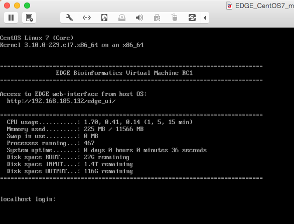

Installation
############

.. note:: These instructions assumes Ubuntu 14 and CentOS 7

EDGE Installation
=================

1. Please ensure that your system has the :doc:`essential software building packages <system_requirement>`. installed properly before proceeding following installation.

2. Download the codebase, third party tools, and databases::

	## Codebase is ~96Mb and contains all the scripts and HTML needed to make EDGE run
	wget -c https://edge-dl.lanl.gov/EDGE/1.5/edge_v1.5_main.tgz

	## Third party tools is ~1.9Gb and contains the underlying programs needed to do the analysis
	wget -c https://edge-dl.lanl.gov/EDGE/1.5/edge_v1.5_thirdParty_softwares.tgz

	## Pipeline database is ~7.9Gb and contains the other databases needed for EDGE
	wget -c https://edge-dl.lanl.gov/EDGE/1.5/edge_v1.5_pipeline_databases.tgz
	
	## GOTTCHA database is ~16Gb and contains the custom databases for the GOTTCHA taxonomic identification pipeline
	wget -c https://edge-dl.lanl.gov/EDGE/1.5/edge_v1.5_GOTTCHA_db.tgz
	
	## BWA index is ~41Gb and contains the databases for bwa taxonomic identification pipeline
	wget -c https://edge-dl.lanl.gov/EDGE/1.5/edge_v1.5_bwa_index.tgz

	## NCBI Genomes is ~8Gb and contain the full genomes for prokaryotes and some viruses
	wget -c https://edge-dl.lanl.gov/EDGE/1.5/edge_v1.5_NCBI_genomes.tgz
	
	## Amplicon database is ~78Mb and contains the databases for Qiime 16s and 18s ITS pipeline
	wget -c https://edge-dl.lanl.gov/EDGE/1.5/edge_v1.5_amplicon.tgz
	
	## NT database is ~25Gb and contains the NCBI nt database for contig identification
	wget -c https://edge-dl.lanl.gov/EDGE/1.5/edge_v1.5_nt_20160426.tgz
	
	## ShortBRED database is ~27Mb and contains the databases used by ShortBRED for virulence factors and read based antibiotic resistance analysis
	wget -c https://edge-dl.lanl.gov/EDGE/1.5/edge_v1.5_ShortBRED_Database.tgz

.. warning:: Be patient; the database files are huge.

3. Unpack main archive::

	tar -xvzf edge_v1.5_main.tgz

.. note:: The main directory, edge_v1.5, will be created.

	Create a link from edge to that directory::

		ln -sf edge_v1.5 edge

4. Unpack the third party software into main directory (edge)::

	tar -xvzf edge_v1.5_thirdParty_softwares.tgz -C edge/

.. note:: You should see a thirdParty directory inside the edge directory.

5 Unpack the databases::

	tar -xvzf edge_v1.5_pipeline_databases.tgz
	tar -xvzf edge_v1.5_GOTTCHA_db.tgz
	tar -xzvf edge_v1.5_bwa_index.tgz
	tar -xvzf edge_v1.5_NCBI_genomes.tgz
	tar -xvzf edge_v1.5_amplicon.tgz
	tar -xzvf edge_v1.5_nt_20160426.tgz
	tar -xzvf edge_v1.5_ShortBRED_Database.tgz

.. note:: At this point, you should see a database directory and the edge directory.

6. Create the symlink from edge to the database directory::

	ln -s `pwd`/database edge/database

.. note:: This will keep the database directory outside of the edge install location.  Should you need to reinstall the code base you will not need to redownload/install the databases.

7. Installing pipeline::

	cd edge
	./INSTALL.sh

  It will install the following depended :doc:`tools <third_party>`.

  * Assembly

	* idba
	* spades
	* megahit

  * Annotation

	* prokka
	* RATT
	* tRNAscan
	* barrnap
	* BLAST+
	* blastall
	* phageFinder
	* glimmer
	* aragorn
	* prodigal
	* tbl2asn
	* ShortBRED

  * Alignment

	* hmmer
	* infernal
	* bowtie2
	* bwa
	* mummer
	* RAPSearch2

  * Taxonomy

	* kraken
	* metaphlan
	* kronatools
	* gottcha

  * Phylogeny

	* FastTree
	* RAxML

  * Specialty Genes

	* ShortBRED (with VFDB)
	* RGI (from CARD)

  * Utility

	* bedtools
	* R
	* GNU_parallel
	* tabix
	* JBrowse
	* primer3
	* samtools
	* sratoolkit
	* ea-utils
	* Anaconda2 (Python 2)

  * Perl_Modules

	* perl_parallel_forkmanager
	* perl_excel_writer
	* perl_archive_zip
	* perl_string_approx
	* perl_pdf_api2
	* perl_html_template
	* perl_html_parser
	* perl_JSON
	* perl_bio_phylo
	* perl_xml_twig
	* perl_cgi_session

8. Restart the Terminal Session to allow $EDGE_HOME to be exported.

.. note:: After running INSTALL.sh successfully, the binaries and related scripts will be stored in the ./bin and ./scripts directory. It also writes EDGE_HOME environment variable into .bashrc or .bash_profile.

.. _apache_configuration:

Apache Web Server Configuration
-------------------------------

1. Modify/Check sample apache configuration file::

	For Ubuntu

	Double check that the alias directories have the correct prefix (typically /home/edge/edge/edge_ui/) in 
	$EDGE_HOME/edge_ui/apache_conf/edge_apache.conf on lines 2,3,13,14,26,56.

	The default installation is configured as $EDGE_HOME/edge_ui/ (typically /home/edge/edge/edge_ui/).

	For CentOS

	Double check that the alias directories have the correct prefix (typically /home/edge/edge/edge_ui/) in 
	$EDGE_HOME/edge_ui/apache_conf/edge_httpd.conf on lines 2,3,13,14,26,56.

	The default installation is configured as $EDGE_HOME/edge_ui/ (typically /home/edge/edge/edge_ui/).

2. Confirm apache/httpd user and groups are edge::

	For Ubuntu

	The user and group can be edited at /etc/apache2/envvars and the variables are APACHE_RUN_USER and APACHE_RUN_GROUP.

	For CentOS

	The User and Group on lines 66 and 67 in $EDGE_HOME/edge_ui/apache_conf/centos_httpd.conf should be edge
	
.. note:: This assumes that EDGE is being installed on a server with the user edge

3. (Optional) If users are behind a corporate proxy for internet::

	Please add proxy info into $EDGE_HOME/edge_ui/apache_conf/edge_apache.conf or $EDGE_HOME/edge_ui/apache_conf/edge_httpd.conf

	# Add following proxy env
	SetEnv http_proxy http://yourproxy:port
	SetEnv https_proxy http://yourproxy:port
	SetEnv ftp_proxy http://yourproxy:port

4. Copy configuration files to the appropriate directories::

	For Ubuntu

	cp $EDGE_HOME/edge_ui/apache_conf/edge_apache.conf /etc/apache2/conf-available/
	ln -s /etc/apache2/conf-available/edge_apache.conf /etc/apache2/conf-enabled/

	For CentOS

	sudo cp $EDGE_HOME/edge_ui/apache_conf/edge_httpd.conf /etc/httpd/conf.d/
	sudo cp $EDGE_HOME/edge_ui/apache_conf/centos_httpd.conf /etc/httpd/conf/httpd.conf

5. Restart the apache2/httpd to activate the new configuration::

	For Ubuntu

	sudo service apache2 restart

	For CentOS

	sudo systemctl restart httpd

User Management System Installation: MySQL
------------------------------------------
.. note:: 
	Setup two temporary environmental variables::

		UN=username
		PW=password

	These will be used when setting up the user management system

.. note:: 
	If you were using the user management system and are updating from EDGE v1.1 to v1.5. You only need to run the commands below and continue to install tomcat.::
 
		mysql -u $UN -p userManagement
		mysql> ALTER TABLE projects ADD full_name VARCHAR(255);
		mysql> ALTER TABLE users_projects add display varchar(25) NOT NULL DEFAULT 'yes';
		mysql> ALTER TABLE users_projects ADD CONSTRAINT displayChk CHECK (display IN ('yes','no'));

1. Start mysql (if it is not already running)::

	For Ubuntu

	sudo service mysql start

	For CentOS

	sudo systemctl start mariadb.service && sudo systemctl enable mariadb.service

2. Secure mysql:

	.. note:: The root password here is for the mysql root and not the system root.

	::

	sudo mysql_secure_installation

	1. Enter root password (likely none)
	2. Set root password?  Yes
	3. Enter new root password.
	4. Re-enter new root password.
	5. Remove anonymous users? Yes
	6. Disallow root login remotely? Yes
	7. Remove test database and access to it? Yes
	8. Reload privilege table now? Yes

3. Create database: userManagement::

	 cd $EDGE_HOME/userManagement
	 mysql -p -u root

	 mysql> create database userManagement;
	 mysql> use userManagement;

4. Load userManagement_schema.sql::

	mysql> source userManagement_schema.sql;

5. Load userManagement_constrains.sql::

	mysql> source userManagement_constrains.sql;

6. Create an user account and grant all privileges to user:

	.. note::

		This is the database user (not an individual account). 
		
		Replace with the appropriate values::

			username: yourDBUsername
			password: yourDBPassword

	::

		mysql> CREATE USER 'yourDBUsername'@'localhost' IDENTIFIED BY 'yourDBPassword';
		mysql> GRANT ALL PRIVILEGES ON userManagement.* to 'yourDBUsername'@'localhost';
		mysql> exit;

User Management System Installation: Tomcat
-------------------------------------------

1. Configure tomcat basic auth to secure /user/admin/register web service:

	.. warning:: Run this code only once!

	.. note::

		The username and password here should be the same as the database user.

		Update the values for the username and password accordingly before running the code.

		This adds the following to /usr/share/tomcat/conf/tomcat-users.xml::

			<role rolename="admin"/>
			<user username="yourAdminName" password="yourAdminPassword" roles="admin"/>

	::

		For Ubuntu

		sudo sed -i 's@<!-- <role rolename="admin"/> -->@<!-- <role rolename="admin"/> -->\n<role rolename="admin"/>\n<user username="'"${UN}"'" password="'"${PW}"'" roles="admin"/>@g' /var/lib/tomcat7/conf/tomcat-users.xml

		For CentOS

		sudo sed -i 's@<!-- <role rolename="admin"/> -->@<!-- <role rolename="admin"/> -->\n<role rolename="admin"/>\n<user username="'"${UN}"'" password="'"${PW}"'" roles="admin"/>@g' /usr/share/tomcat/conf/tomcat-users.xml

2. Update inactive timeout to a more reasonable number 4320 min (3 days) from default (30mins) in /var/lib/tomcat7/conf/web.xml or /etc/tomcat/web.xml

	.. note::

		This is modifying the following code::

			<!--  <session-config>
				<session-timeout>30</session-timeout>
			</session-config> -->

	::

		For Ubuntu

		sudo sed -i 's@<session-timeout>.*</session-timeout>@<session-timeout>4320</session-timeout>@g' /var/lib/tomcat7/conf/web.xml

		For CentOS

		sudo sed -i 's@<session-timeout>.*</session-timeout>@<session-timeout>4320</session-timeout>@g' /usr/share/tomcat/conf/web.xml

3. Add memory constrains to Java:

	.. warning:: Run this code only once!

	.. note::

		This will add the following line to the appropriate file::

			JAVA_OPTS=" -Xms256M -Xmx1024M -XX:PermSize=256m -XX:MaxPermSize=512m"

	::

		For Ubuntu

		sudo sed -i 's@#JAVA_OPTS@JAVA_OPTS="-Xms256m -Xmx1024m -XX:PermSize=256m -XX:MaxPermSize=512m"\n#JAVA_OPTS@g' /usr/share/tomcat7/bin/catalina.sh

		For CentOS

		sudo sed -i 's@#JAVA_OPTS@JAVA_OPTS="-Xms256m -Xmx1024m -XX:PermSize=256m -XX:MaxPermSize=512m"\n#JAVA_OPTS@g' /usr/share/tomcat/conf/tomcat.conf

4. Restart tomcat server::

	For Ubuntu
	sudo service tomcat7 restart

	For CentOS7
	sudo systemctl restart tomcat

5. Copy database connector clients to appropriate lib directory::

	For Ubuntu

	sudo cp mysql-connector-java-5.1.34-bin.jar /usr/share/tomcat7/lib/

	For CentOS

	sudo cp mariadb-java-client-1.2.0.jar /usr/share/tomcat/lib/

6. Centos Only: Update the MySQL database driver to be used::

	sed -i 's@driverClassName=.*$@driverClassName="org.mariadb.jdbc.Driver"@' $EDGE_HOME/userManagement/userManagementWS.xml

7. Deploy userManagement to tomcat server:

	.. note::

		For CentOS the userManagementWS.xml should have:: 

			driverClassName="org.mariadb.jdbc.Driver"

		Please check and confirm this before deploying userManagemnt.

	::

		For Ubuntu

		sudo cp userManagementWS.war /var/lib/tomcat7/webapps/
		sudo cp userManagementWS.xml /var/lib/tomcat7/conf/Catalina/localhost/
		sudo cp userManagement.war /var/lib/tomcat7/webapps

		For CentOS

		sudo cp userManagementWS.war /var/lib/tomcat/webapps/
		sudo cp userManagementWS.xml /etc/tomcat/Catalina/localhost/
		sudo cp userManagement.war /var/lib/tomcat/webapps

8. Modify the username/password in userManagementWS.xml::

	For Ubuntu
	
	sudo sed -i 's@username=.*$@username="'"${UN}"'"@' /var/lib/tomcat7/conf/Catalina/localhost/userManagementWS.xml
	sudo sed -i 's@password=.*$@password="'"${PW}"'"@' /var/lib/tomcat7/conf/Catalina/localhost/userManagementWS.xml

	For CentOS
	
	sudo sed -i 's@username=.*$@username="'"${UN}"'"@' /etc/tomcat/Catalina/localhost/userManagementWS.xml
	sudo sed -i 's@password=.*$@password="'"${PW}"'"@' /etc/tomcat/Catalina/localhost/userManagementWS.xml

9. Update sys.properties in the userManagement deployment:

	.. note::

		Tomcat should automatically unarchive the .war files. 

		The default configuration is to have the user management system on localhost with email notifications turned off.

		Modify the user management sys.properties if you want to change the default behavior.

		You will need to copy the sys.properties files to the directory of the userManagement deployment.

	::

		For Ubuntu

		sudo cp $EDGE_HOME/userManagement/sys.properties /var/lib/tomcat7/webapps/userManagement/WEB-INF/classes/sys.properties

		For CentOS

		sudo cp $EDGE_HOME/userManagement/sys.properties /usr/share/tomcat/webapps/userManagement/WEB-INF/classes/sys.properties

10. Restart tomcat server::

	For Ubuntu
	sudo service tomcat7 restart

	For CentOS7
	sudo systemctl restart tomcat

11. Setup admin user:

	.. note::

		The script createAdminAccount.pl creates an admin user account for EDGE userManagement.

			Update email (-e), password (-p), First Name (-fn), and Last Name (-ln) appropriately.

		Should this script fail, the userManagemnt is not set up correctly.

	::

		perl createAdminAccount.pl -e <email> -fn <first name> -ln <last name>

Special Database Installation: Virulence Factors
------------------------------------------------

.. note:: This requires that MySQL is installed and running.

.. note:: EDGE provides Virulence Factors sql dump file which will be used for Speciality Gene Profling module.

1. Change directory into ShortBRED Virulence Factor databases directory::

	cd $EDGE_HOME/database/ShortBRED/VF/

2. Run install script for Virulence database and grant privileges to database user to have access to the database::

	mysql -u root -p 
	mysql> source virulence_db.sql ;
	mysql> GRANT ALL PRIVILEGES ON virulenceFactors.* to 'yourDBUsername'@'localhost';
	mysql> exit;

3. Configure Virulence Database information in sys.properties::

	Edit $EDGE_HOME/edge_ui/sys.properties with the appropriate database username and password.

	# Virulence Factor Database
	VFDB_dbhost=localhost
	VFDB_dbport=3306
	VFDB_dbname=virulenceFactors
	VFDB_dbuser=edge_user
	VFDB_dbpasswd=edge_user_password

.. _edge_configuration: 

EDGE configuration
------------------

.. note:: EDGE system configuration file is $EDGE_HOME/edge_ui/sys.properties. You can edit this file to turn on/off EDGE functions/modules here. (on=1, off=0);

1. User management system:

	.. note::

		The default install for user management is localhost. Update the domain as necessary if user management system is not in the same domain as EDGE.::

			edge_user_management_url=http://www.someother.com/userManagement

		This requires additional setup not documented.

	::

		# If you have User Management system enabled.
		user_management=1
		edge_user_management_url=http://localhost/userManagement

3. Upload function::

	user_upload=1
	user_upload_maxFileSize='5gb'
	
4. Project clean up::

	#Clean up old bam/sam/fastq/gz files (based on file age) in project directories
	edgeui_proj_store_days=10

5. Archive directory::

	#The archive space is for offload the main computational disk space
	edgeui_archive=/path/to/archive_SPACE

6. Optional: configure sendmail to use SMTP to email out of local domain::

	* edit /etc/mail/sendmail.cf and edit this line:

		# "Smart" relay host (may be null)
		DS

	* and append the correct server right next to DS (no spaces);

		# "Smart" relay host (may be null)
		DSmail.yourdomain.com

	* Then, restart the sendmail service

		sudo service sendmail restart

EDGE Docker image
=================

EDGE has a lot of dependencies and can (but doesn't have to) be very challenging to install. The EDGE docker gets around the difficulty of installation by providing a functioning EDGE full install on top of offical Ubuntu 14.04.5 LTS.
You can find the image and usage at `docker hub <https://hub.docker.com/r/chienchilo/edge_v1.5/>`_.

.. figure:: img/docker.png
	:scale: 100 %

EDGE VMware/OVF Image
=====================

You can start using EDGE by launching a local instance of the EDGE VM. The image is built by `VMware Fusion v8.5.0 <https://my.vmware.com/web/vmware/info?slug=desktop_end_user_computing/vmware_workstation/8_0>`_. 
The pre-built EDGE VM is provided in `Open Virtualization Format (OVA/OVF) <https://en.wikipedia.org/wiki/Open_Virtualization_Format>`_ which is supported by major virtualization players, such as VMware / VirtualBox / Red Hat Enterprise Virtualization, etc. 
Unfortunately, this may not always work perfectly, as each VM technology seems to use slightly different OVA/OVF implementations that aren’t entirely compatible. For example, the `auto-deploy <https://kb.vmware.com/selfservice/microsites/search.do?language=en_US&cmd=displayKC&externalId=2005131>`_ feature and `the path of auto-mount shared folders <http://pubs.vmware.com/fusion-4/index.jsp#com.vmware.fusion.help.doc/GUID-5FAA1AF9-C886-40E9-87CD-770235EFB754.html?resultof=%2522%2553%2568%2561%2572%2565%2564%2522%2520%2522%2573%2568%2561%2572%2565%2522%2520%2522%2566%256f%256c%2564%2565%2572%2522%2520>`_ between host and guest which are used in the EDGE VMware image may not be compatible with other VM technologies (or may need advanced tweaks). 
Therefore, we highly recommended using `VMware Workstation Player <http://www.vmware.com/products/player/playerpro-evaluation.html>`_ which is free for non-commercial, personal and home use. 
The `EDGE databases <installation.html#edge-installation>`_ are not included in the image. You will need to download and mount the databases, input and output directories after you launch the VM. Below are instructions to run EDGE VM on your local server:

1. Install `VMware Workstation player <http://www.vmware.com/products/player/playerpro-evaluation.html>`_ .
2. Download the EDGE VM image (EDGE_vm_1.5_RC1.ova) from `LANL FTP site <https://edge-dl.lanl.gov/EDGE/1.5/VirtualMachine/>`_.
3. Download the `EDGE databases <installation.html#edge-installation>`_ and follow instruction to unpack them. 
4. Import the EDGE VM image. If the first time import fails (due to strict OVF specification), click **"Retry"**; this will allow import of the image.

.. figure:: img/VMware_import.png
	:width: 70 %
	

	
5. Configure your VM.

  * Allocate at least 10GB memory to the VM
  * Share/Mount the database, input and output directory to the "database", "EDGE_input" and "EDGE_output" directory in the VM guest OS. 

6. Start EDGE VM.
7. Access EDGE VM using host browser (http://<IP_OF_VM>/edge_ui/).

Note that the IP address will also be provided when the instance starts up.

8. Control EDGE VM with default credentials.

  * OS Login: edge/edge
  * EDGE user: admin@my.edge/admin
  * MariaDB root: root/edge

