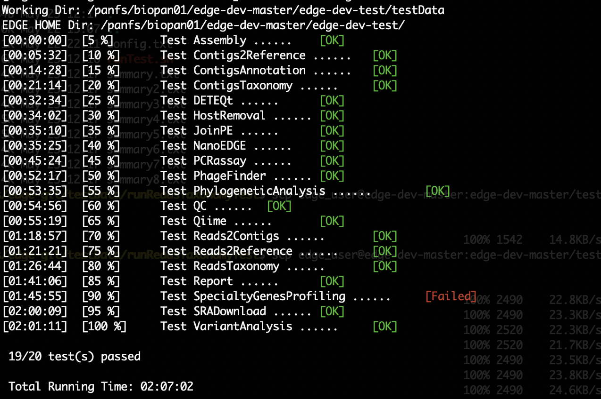

Installation
############

EDGE Installation
=================

.. note:: A base install is ~8GB for the code base and ~177GB for the databases.

1. Please ensure that your system has the :doc:`essential software building packages <system_requirement>`. installed properly before proceeding following installation.

2. Download the codebase, databases and third party tools. ::
   
    ## Codebase is ~68Mb and contains all the scripts and HTML needed to make EDGE run
    wget -c https://edge-dl.lanl.gov/EDGE/1.1/edge_main_v1.1.1.tgz
    
    ## Third party tools is ~1.9Gb and contains the underlying programs needed to do the analysis
    wget -c https://edge-dl.lanl.gov/EDGE/1.1/edge_v1.1_thirdParty_softwares.tgz
    
    ## Pipeline database is ~7.9Gb and contains the other databases needed for EDGE
    wget -c https://edge-dl.lanl.gov/EDGE/1.1/edge_pipeline_v1.1.databases.tgz
    
    ## GOTTCHA database is ~14Gb and contains the custom databases for the GOTTCHA taxonomic identification pipeline
    wget -c https://edge-dl.lanl.gov/EDGE/1.1/GOTTCHA_db_for_edge_v1.1.tgz
    
    ## BWA index is ~41Gb and contains the databases for bwa taxonomic identification pipeline
    wget -c https://edge-dl.lanl.gov/EDGE/1.1/bwa_index1.1.tgz
    
    ## NCBI Genomes is ~8Gb and contain the full genomes for prokaryotes and some viruses
    wget -c https://edge-dl.lanl.gov/EDGE/1.1/NCBI_genomes_for_edge_v1.1.tar.gz 

.. warning:: Be patient; the database files are huge.

3. Unpack main archive::

    tar -xvzf edge_main_v1.1.1.tgz

.. note:: The main directory, edge_v1.1.1, will be created.

4. Move the database and third party archives into main directory (edge_v1.1.1)::

    mv edge_v1.1_thirdParty_softwares.tgz edge_v1.1.1/
    mv edge_pipeline_v1.1.databases.tgz edge_v1.1.1/
    mv GOTTCHA_db_for_edge_v1.1.tgz edge_v1.1.1/
    mv bwa_index1.1.tgz edge_v1.1.1/
    mv NCBI_genomes_for_edge_v1.1.tar.gz edge_v1.1.1/

5. Change directory to main directory and unpack databases and third party tools archive::

    cd edge_v1.1.1
    
    # unpack third party tools
    tar -xvzf edge_v1.1_thirdParty_softwares.tgz
    
    # unpack databases
    tar -xvzf edge_pipeline_v1.1.databases.tgz
    tar -xvzf GOTTCHA_db_for_edge_v1.1.tgz
    tar -xzvf bwa_index1.1.tgz
    tar -xvzf NCBI_genomes_for_edge_v1.1.tar.gz

.. note:: To this point, you should see a database directory and a thirdParty directory in the main directory

6. Installing pipeline::

    ./INSTALL.sh

  It will install the following depended :doc:`tools <third_party>`.

  * Assembly

    * idba
    * spades

  * Annotation

    * prokka
    * RATT
    * tRNAscan
    * barrnap
    * BLAST+
    * blastall
    * phageFinder
    * glimmer
    * aragorn
    * prodigal
    * tbl2asn

  * Alignment

    * hmmer
    * infernal
    * bowtie2
    * bwa
    * mummer

  * Taxonomy

    * kraken
    * metaphlan
    * kronatools
    * gottcha
    
  * Phylogeny

    * FastTree
    * RAxML

  * Utility

    * bedtools
    * R
    * GNU_parallel
    * tabix
    * JBrowse
    * primer3
    * samtools
    * sratoolkit

  * Perl_Modules

    * perl_parallel_forkmanager
    * perl_excel_writer
    * perl_archive_zip
    * perl_string_approx
    * perl_pdf_api2
    * perl_html_template
    * perl_html_parser
    * perl_JSON
    * perl_bio_phylo
    * perl_xml_twig
    * perl_cgi_session

7. Restart the Terminal Session to allow $EDGE_HOME to be exported.

.. note:: After running INSTALL.sh successfully, the binaries and related scripts will be stored in the ./bin and ./scripts directory. It also writes EDGE_HOME environment variable into .bashrc or .bash_profile.

Testing the EDGE Installation
-----------------------------

After installing the packages above, it is highly recommended to test the installation::

    > cd $EDGE_HOME/testData
    > ./runAllTest.sh

There are 15 module/unit tests which took around 44 mins in our testing environments. (24 cores 2.60GHz, 512GB ram with Ubuntu 14.04.3 LTS ). 
You will see test output on the terminal indicating test successes and failures. Some tests may fail due to missing external applications/modules/packages or failed installation.
These will be noted separately in the $EDGE_HOME/testData/runXXXXTest/TestOutput/error.log or log files in each modules. If these are related to features of EDGE that you are not using, this is acceptable. 
Otherwise, you’ll want to ensure that you have the EDGE installed correctly. If the output doesn't indicate any failures, you are now ready to use EDGE through command line. 
To take advantage of the user friendly GUI, please follow the section below to configure the EDGE Web server. 

.. _apache_configuration:

Apache Web Server Configuration
-------------------------------

1. Install apache2 ::

    For Ubuntu

    > sudo apt-get install apache2

    For CentOS

    > sudo yum -y install httpd

2. Enable apache cgid, proxy, headers modules::

    For Ubuntu

    > sudo a2enmod cgid proxy proxy_http headers

3. Modify/Check sample apache configuration file::

	Double check $EDGE_HOME/edge_ui/apache_conf/edge_apache.conf alias directories to match EDGE 
	installation path at line 2,3,13,14,26,51. 
	The default is configured as http://localhost/edge_ui/ or http://www.yourdomain.com/edge_ui/
4. (Optional) If users are behind a corporate proxy for internet::

	Please add proxy info into $EDGE_HOME/edge_ui/apache_conf/edge_apache.conf or $EDGE_HOME/edge_ui/apache_conf/edge_httpd.conf

	# Add following proxy env
	SetEnv http_proxy http://yourproxy:port
	SetEnv https_proxy http://yourproxy:port
	SetEnv ftp_proxy http://yourproxy:port

5. Copy modified edge_apache.conf to the apache or Insert content into httpd.conf ::

    For Ubuntu

    > cp $EDGE_HOME/edge_ui/apache_conf/edge_apache.conf /etc/apache2/conf-available/
    > ln -s /etc/apache2/conf-available/edge_apache.conf /etc/apache2/conf-enabled/

    For CentOS

    > cp $EDGE_HOME/edge_ui/apache_conf/edge_apache.conf /etc/httpd/conf.d/

6. Modify permissions:  modify permissions on installed directory to match apache user ::
	
    For Ubuntu 14, the user can be edited at /etc/apache2/envvars and the variable are APACHE_RUN_USER and APACHE_RUN_GROUP.

    For CentOS, the user can be edited at /etc/httpd/conf/httpd.conf and the variable are User and Group.

    > chown -R xxxxx $EDGE_HOME/edge_ui  $EDGE_HOME/edge_ui/JBrowse/data  #(xxxxx is the APACHE_RUN_USER value)

    > chgrp -R xxxxx $EDGE_HOME/edge_ui  $EDGE_HOME/edge_ui/JBrowse/data  #(xxxxx is the APACHE_RUN_GROUP value)

7. Restart the apache2 to activate the new configuration ::

    For Ubuntu

    >sudo service apache2 restart

    For CentOS

    >sudo httpd -k restart

User Management system installation
-----------------------------------

1. Create database: userManagement::

    > cd $EDGE_HOME/userManagement
    > mysql -p -u root
    mysql> create database userManagement;
    mysql> use userManagement;
    
.. note :: make sure mysql is running. If not, run "sudo service mysqld start".;
           
           for CentOS7: "sudo systemctl start mariadb.service && sudo systemctl enable mariadb.service"

2. Load userManagement_schema.sql::

    mysql> source userManagement_schema.sql;

3. Load userManagement_constrains.sql::

    mysql> source userManagement_constrains.sql;

4. Create an user account ::

       username: yourDBUsername
       password: yourDBPassword
       (also modify the username/password in userManagementWS.xml file)
    and grant all privileges on database "userManagement" to user yourDBUsername

    mysql> CREATE USER 'yourDBUsername'@'localhost' IDENTIFIED BY 'yourDBPassword';

    mysql> GRANT ALL PRIVILEGES ON userManagement.* to 'yourDBUsername'@'localhost';
    
    mysql>exit;

5. Configure tomcat::

    * Copy mysql-connector-java-5.1.34-bin.jar to /usr/share/tomcat/lib/

        For Ubuntu and CentOS6
        > cp mysql-connector-java-5.1.34-bin.jar /usr/share/tomcat7/lib/
        For CentOS7
        > cp mariadb-java-client-1.2.0.jar /usr/share/tomcat/lib/

    * Configure tomcat basic auth to secure /user/admin/register web service
      add lines below to /var/lib/tomcat7/conf/tomcat-users.xml of Ubuntu or /etc/tomcat/tomcat-users.xml of CentOS

        <role rolename="admin"/>
        <user username="yourAdminName" password="yourAdminPassword" roles="admin"/>
        
        (also modify the username and password in createAdminAccount.pl file)

    * Inactive timeout in /var/lib/tomcat7/conf/web.xml or /etc/tomcat/web.xml (default is 30mins)

        <!--  <session-config>
            <session-timeout>30</session-timeout>
        </session-config> -->

    * add the line below to tomcat /usr/share/tomcat7/bin/catalina.sh of Ubuntu or /etc/tomcat/tomcat.conf of CentOS to increase PermSize:

        JAVA_OPTS=" -Xms256M -Xmx1024M -XX:PermSize=256m -XX:MaxPermSize=512m"

    * Restart tomcat server
    
        for Ubuntu
        > sudo service tomcat7 restart 
        for CentOS6
        > sudo service tomcat restart
        for CentOS7
        > sudo systemctl restart tomcat.service

    * Deploy userManagementWS to tomcat server

        for Ubuntu
        > cp userManagementWS.war /var/lib/tomcat7/webapps/
        > cp userManagementWS.xml /var/lib/tomcat7/conf/Catalina/localhost/
        for CentOS
        > cp userManagementWS.war /var/lib/tomcat/webapps/
        > cp userManagementWS.xml /etc/tomcat/Catalina/localhost/
        
        (for CentOS7. The userManagementWS.xml needs to modify the sql connector where driverClassName="org.mariadb.jdbc.Driver")

    * Deploy userManagement to tomcat server
        
        for Ubuntu
        > cp userManagement.war /var/lib/tomcat7/webapps
        for CentOS
        > cp userManagement.war /var/lib/tomcat/webapps

    * Change settings in /var/lib/tomcat7/webapps/userManagement/WEB-INF/classes/sys.properties of Ubuntu.
                        /var/lib/tomcat/webapps/userManagement/WEB-INF/classes/sys.properties of CentOS.
        
        host_url=http://www.yourdomain.com:8080/userManagement
        email_sender=admin@yourdomain.com
        email_host=mail.yourdomain.com
        
.. note:: tomcat files in /var/lib/tomcat7 & /usr/share/tomcat7 for Ubuntu
                        in /var/lib/tomcat & /usr/share/tomcat & /etc/tomcat for CentOS

          The tomcat server will automatically decompress the userManagementWS.war
          and userManagement.war ;

6. Setup admin user::

    * run script createAdminAccount.pl to add admin account with encrypted password to database

        > perl createAdminAccount.pl -e admin@my.com -p admin -fn <first name> -ln <last name>

7. Configure the EDGE to use the user management system

	* edit $EDGE_HOME/edge_ui/cgi-bin/edge_config.tmpl where user_management=1

.. note :: If user management system is not in the same domain with edge. ex: http://www.someother.com/userManagement
           The parameter: edge_user_management_url=http://www.someother.com/userManagement

8. Enable social (facebook,google,windows live, Linkedin) login function

    * edit $EDGE_HOME/edge_ui/cgi-bin/edge_config.tmpl where user_social_login=1

    * modify $EDGE_HOME/edge_ui/cgi-bin/edge_user_management.cgi at line 108/109 of the admin_email and password according to #6 above.

    * modify $EDGE_HOME/edge_ui/javascript/social.js, change apps id you created on each social media. 

.. note :: You need to register your EDGE's domain on each social media to get apps id. e.g.: A FACEBOOK app needs to be created and configured for the domain and website set up by EDGE.
           see `https://developers.facebook.com/ <https://developers.facebook.com/.>`_  and
           `StackOverflow Q&A <http://stackoverflow.com/questions/16345777/given-url-is-not-allowed-by-the-application-configuration>`_
           
           `Google+ <https://console.developers.google.com/>`_
           
           `Windows <https://account.live.com/developers/applications/index>`_
           
           `LinkedIn <https://www.linkedin.com/secure/developer>`_
           

9. Optional: configure sendmail to use SMTP to email out of local domain::

    * edit /etc/mail/sendmail.cf and edit this line:

        # "Smart" relay host (may be null)
        DS

    * and append the correct server right next to DS (no spaces);

        # "Smart" relay host (may be null)
        DSmail.yourdomain.com

    * Then, restart the sendmail service

        > sudo service sendmail restart

EDGE Docker image
=================

EDGE has a lot of dependencies and can (but doesn’t have to) be very challenging to install. The EDGE docker gets around the difficulty of installation by providing a functioning EDGE full install on top of offical Ubuntu 14.04.3 LTS. 
You can find the image and usage at `docker hub <https://hub.docker.com/r/chienchilo/bioedge/>`_. 

EDGE VMware/OVF Image
=====================

You can start using EDGE by launching a local instance of the EDGE VM. The image is built by `VMware Fusion v8.0 <https://my.vmware.com/web/vmware/info?slug=desktop_end_user_computing/vmware_workstation/8_0>`_. 
The pre-built EDGE VM is provided in `Open Virtualization Format (OVA/OVF) <https://en.wikipedia.org/wiki/Open_Virtualization_Format>`_ which is supported by major virtualization players, such as VMware / VirtualBox / Red Hat Enterprise Virtualization, etc. 
Unfortunately, this may not always work perfectly, as each VM technology seems to use slightly different OVA/OVF implementations that aren’t entirely compatible. For example, the `auto-deploy <https://kb.vmware.com/selfservice/microsites/search.do?language=en_US&cmd=displayKC&externalId=2005131>`_ feature and `the path of auto-mount shared folders <http://pubs.vmware.com/fusion-4/index.jsp#com.vmware.fusion.help.doc/GUID-5FAA1AF9-C886-40E9-87CD-770235EFB754.html?resultof=%2522%2553%2568%2561%2572%2565%2564%2522%2520%2522%2573%2568%2561%2572%2565%2522%2520%2522%2566%256f%256c%2564%2565%2572%2522%2520>`_ between host and guest which are used in the EDGE VMware image may not be compatible with other VM technologies (or may need advanced tweaks). 
Therefore, we highly recommended using `VMware Workstation Player <http://www.vmware.com/products/player/playerpro-evaluation.html>`_ which is free for non-commercial, personal and home use. 
The `EDGE databases <installation.html#edge-installation>`_ are not included in the image. You will need to download and mount the databases, input and output directories after you launch the VM. Below are instructions to run EDGE VM on your local server:

1. Install `VMware Workstation player <http://www.vmware.com/products/player/playerpro-evaluation.html>`_ .
2. Download VM image (EDGE_vm_RC1.ova) from `LANL FTP site <https://edge-dl.lanl.gov/EDGE/VirtualMachine/>`_.
3. Download the `EDGE databases <installation.html#edge-installation>`_ and follow instruction to unpack them.
4. Configure your VM

  * Allocate at least 10GB memory to the VM
  * Share the database, input and output directory to the "database", "EDGE_input" and "EDGE_output" directory in the VM guest OS. If you use VMware, the "Sharing settings" should look like:

.. figure:: img/VMware_Sharing_settings.png
	:scale: 100 %

5. Start EDGE VM.
6. Access EDGE VM using host browser (http://<IP_OF_VM>/edge_ui/).

Note that the IP address will also be provided when the instance starts up.

.. figure:: img/VMware_login.png
	:scale: 100 %
    
7. Control EDGE VM with default credentials.

  * OS Login: edge/edge
  * EDGE user: admin@my.edge/admin
  * MariaDB root: root/edge
